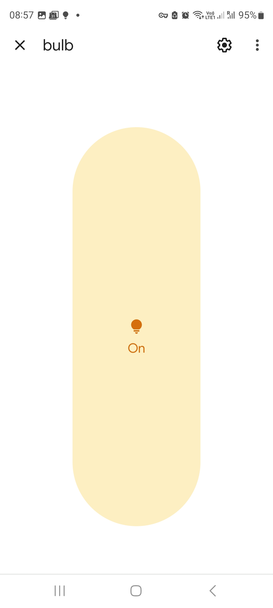

## On/Off Light Matter Device Demo for RP2040

A binary crate that demoes the pure-Rust [matter-rs](https://github.com/project-chip/matter-rs) library on a rp2040-zero board, with the WL5500 Ethernet adapter attached.

Commissioning works with Google Matter Controllers (e.g. Google Nest) as well as the `chip-tool` from the Matter C++ SDK!

### Highlights:
* Bare metal
* no-alloc (except a few, small, upstream allocations in the Rust Crypto libs)
* Utilizes the Embassy echosystem

### Prerequisites

An rp2040 board connected to a WL5500 ethernet adapter. Look at the source w.r.t. which pins need to be connected.

### Build

* Switch to `nightly`: `rustup default nightly`
* Run `cargo build` in the root of the binary crate

### Flash (with elf2uf2-rs)

* Install the `elf2uf2-rs` utility if you don't have it: `cargo install elf2uf2-rs -d rp-matter`
* Set your rp2040 board in USB flash mode and then run `elf2uf2-rs -d target/thumbv6m-none-eabi/debug/rp-matter`

### Run

* The demo will start running right after the flashing procedure and the device would be ready for commissioning
* (NOTE: For demoing purposes, the device - upon restart - forgets that it had been commissioned and runs commissioning mode again)
* You can watch the device console output (and thus the commissioning process) by e.g. typing `screen /dev/tty.usbmodem1411301`

### Commissioning with an Android Phone to a Google Controller (Google Nest Hub or similar)

* You need to first register a test device in Google cloud with VID=0xFFF1 and PID=0x8000. This is necessary, as the firmware uses a test Vendor ID and a test Product ID. Follow [this procedure](https://developers.home.google.com/matter/integration/create)
* Open the Google Home app (install first if you don't have it and register a home controlled by your Google Controller)
* Go to the "Devices" tab and click the `+` (add) button
* Select "New Device" (after a short while the phone will say that a device "test" (or however you have registered your test device in Google cloud) was found)
* Select "Continue" and then "Setup without QR code"
* Type `0087-6800-071` for PIN
* The commissioning process should then start
* Adfter a while, the commissioning process would end with an error message of "Can't reach device"; don't worry about that, we still have a few things to implement; press "Exit setup"
* You should see a new light bulb assigned to your home. You can press it to turn it on and off

### Commissioning with `chip-tool`

* Install [chip-tool](https://github.com/project-chip/connectedhomeip/blob/master/docs/guides/chip_tool_guide.md)
* `./chip-tool pairing code 9 MT:Y.K90Q1212Z6Q66D33P084L90Z.I332SQ43I15T0`
* Once commissioning is complete, you can turn your light bulb on and off by calling `./chip-tool onoff toggle 9 1`

